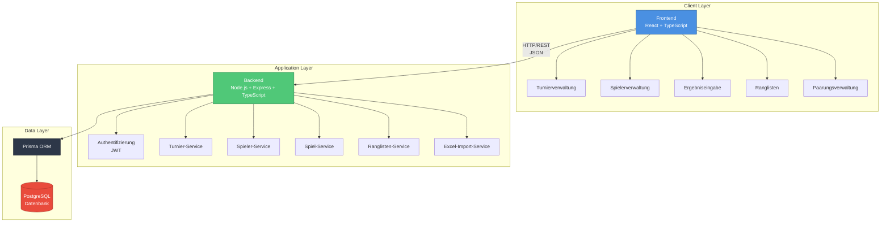

# Systemarchitektur: Jass Tournament Manager

## Übersicht

Die Jass Tournament Manager Applikation folgt einer klassischen **3-Tier-Architektur** mit klarer Trennung zwischen Präsentationsschicht, Geschäftslogik und Datenhaltung.

## Technologie-Stack (Final)

### Frontend
- **Framework**: React 18+ mit TypeScript
- **Build Tool**: Vite
- **Styling**: Tailwind CSS oder Material-UI
- **State Management**: React Context API (Redux bei Bedarf)
- **HTTP Client**: Axios
- **Routing**: React Router v6
- **Form Handling**: React Hook Form + Zod Validation

### Backend
- **Runtime**: Node.js 20+ LTS
- **Framework**: Express.js mit TypeScript
- **ORM**: Prisma (Type-safe Database Access)
- **Authentifizierung**: JWT (JSON Web Tokens) + bcrypt
- **Validierung**: Zod (TypeScript-native Schema Validation)
- **API-Dokumentation**: Swagger/OpenAPI
- **Testing**: Jest + Supertest

### Datenbank
- **DBMS**: PostgreSQL 16
- **Migration**: Prisma Migrate
- **Caching** (optional): Redis für Sessions

### DevOps & Deployment
- **Containerisierung**: Docker + Docker Compose
- **Hosting**: Self-hosted Server
- **Reverse Proxy**: Nginx oder Traefik
- **SSL/HTTPS**: Let's Encrypt (Certbot)
- **Versionskontrolle**: Git + GitHub
- **CI/CD**: GitHub Actions (geplant)

### Vorteile dieser Stack-Kombination
- ✅ **TypeScript End-to-End**: Konsistenz über Frontend und Backend
- ✅ **Code-Sharing**: Type-Definitionen zwischen Client und Server
- ✅ **Prisma**: Type-safe Database Access, automatische Migrations
- ✅ **Schnelle Entwicklung**: Weniger Boilerplate, moderne Toolchain
- ✅ **Docker**: Einfaches Deployment auf eigenem Server

---

## Architekturdiagramm



---

## Komponentenbeschreibung

### Frontend (Presentation Layer)

**Hauptfunktionen:**
- **Turnierverwaltung**: Erstellen, Bearbeiten, Konfigurieren von Turnieren
- **Spielerverwaltung**: Registrierung, Excel-Import, Teilnehmerverwaltung
- **Paarungsverwaltung**: Manuelle Eingabe, automatische Auslosung, Spieler-Selbsteintrag
- **Ergebniseingabe**: Punkteeingabe mit automatischer Berechnung (157 Punkte System)
- **Ranglisten**: Live-Standings, Statistiken, Auswertungen

**Benutzerrollen:**
- **SYSADMIN**: Vollzugriff auf alle Turniere (Support)
- **ORGANIZER**: Eigene Turniere verwalten
- **PLAYER**: Punkte eintragen, Partner wählen, Ranglisten ansehen

**Features:**
- Responsive Design (Desktop & Mobile)
- QR-Code-Generierung für Turnier-Teilnahme
- Konfigurierbarer Punkte-Sichtbarkeit
- Excel-Import für historische Daten

---

### Backend (Application Layer)

**Services:**

#### 1. Authentifizierung-Service
- User Registration & Login
- JWT Token Generation & Validation
- Role-based Access Control (RBAC)
- Password Hashing (bcrypt)

#### 2. Turnier-Service
- CRUD-Operationen für Turniere
- Turnier-Konfiguration (Runden, Spiele, Match-Bonus, etc.)
- QR-Code-Generierung
- Status-Management (PLANNED → IN_PROGRESS → COMPLETED)

#### 3. Spieler-Service
- Teilnehmerverwaltung
- Excel-Import für Spielerdaten
- Email-basiertes Matching
- Spieler-Statistiken

#### 4. Spiel-Service
- Runden- und Spiel-Verwaltung
- Paarungs-Logik (manuell/automatisch)
- Spieler-Selbsteintrag von Partnern
- Spiel-Status-Tracking

#### 5. Ergebnis-Service
- Punkteeingabe
- Automatische Berechnung (157 - eingetragene Punkte)
- Match-Bonus-Logik (+100 bei allen Punkten)
- Validierung

#### 6. Ranglisten-Service
- Berechnung von Standings
- Statistiken über alle Turniere eines Organisators
- Historische Auswertungen

#### 7. Excel-Import-Service
- Import vergangener Turnierdaten
- Parsing von Excel-Dateien
- Validierung und Fehlerbehandlung
- Bulk-Insert mit Transaktionen

**API-Design:**
- RESTful Endpoints
- JSON Request/Response
- Standardisierte Fehlerbehandlung
- Input-Validierung mit Zod
- OpenAPI/Swagger Dokumentation

---

### Datenbank (Data Layer)

**Datenmodell:**
- **8 Hauptentitäten**: User, Tournament, TournamentConfig, TournamentParticipant, Round, Game, GameParticipant, GameScore
- **Hierarchie**: Tournament → Round (5) → Game (8) → Participants (4)
- **Beziehungen**: Klar definierte Foreign Keys mit Cascade-Regeln

**Geschäftsregeln:**
- Organisator-Isolation (außer SYSADMIN)
- 157 Punkte pro Spiel
- Optionaler Match-Bonus (+100)
- Automatische Punkteberechnung
- Flexible Paarungen (fest oder wechselnd)

**Performance:**
- Strategische Indizes auf häufig abgefragten Spalten
- Optimiert für: Organisator-Queries, Turnier-Navigation, Spieler-Lookups

---

## Kommunikationsfluss

### Typischer Request-Flow

1. **Client** sendet HTTP-Request (z.B. GET /api/tournaments)
2. **Express Middleware** validiert JWT Token
3. **Controller** empfängt Request, validiert Input (Zod)
4. **Service Layer** führt Business-Logik aus
5. **Prisma ORM** generiert SQL-Query
6. **PostgreSQL** führt Query aus, gibt Daten zurück
7. **Service** formatiert Response
8. **Controller** sendet JSON-Response an Client
9. **Frontend** aktualisiert UI

---

## Sicherheitsaspekte

### Authentifizierung & Autorisierung
- JWT-basierte Authentifizierung
- HTTP-Only Cookies für Token-Speicherung
- Role-based Access Control (SYSADMIN, ORGANIZER, PLAYER)
- Password Hashing mit bcrypt (Salt Rounds: 10)

### API-Sicherheit
- HTTPS/TLS für alle Kommunikation
- CORS-Konfiguration
- Rate Limiting (Express Rate Limit)
- Input-Validierung auf Frontend und Backend
- SQL-Injection-Schutz durch Prisma (Prepared Statements)
- XSS-Schutz durch React (Auto-Escaping)

### Datenschutz
- Organisator-Isolation (jeder sieht nur eigene Turniere)
- SYSADMIN-Zugriff für Support
- Spieler sehen nur Turniere, an denen sie teilnehmen

---

## Deployment-Architektur (Self-Hosted)

### Docker-Container-Setup

```
┌─────────────────────────────────────────┐
│  Nginx Reverse Proxy                    │
│  - SSL/TLS Termination (Let's Encrypt)  │
│  - Static File Serving (Frontend)       │
│  - Proxy zu Backend                     │
└─────────────────────────────────────────┘
                  ↓
┌─────────────────────────────────────────┐
│  Frontend Container (Optional)          │
│  - React Build (Static Files)           │
│  - Nginx Server                         │
└─────────────────────────────────────────┘
                  ↓
┌─────────────────────────────────────────┐
│  Backend Container                      │
│  - Node.js + Express                    │
│  - Port 3000 (intern)                   │
└─────────────────────────────────────────┘
                  ↓
┌─────────────────────────────────────────┐
│  PostgreSQL Container                   │
│  - Port 5432 (intern)                   │
│  - Volume: /var/lib/postgresql/data     │
└─────────────────────────────────────────┘
```

### Backup-Strategie
- Automatische PostgreSQL Backups (pg_dump)
- Tägliche Backups mit Rotation (7 Tage)
- Volume-Backups für Datenpersistenz

---

## Skalierbarkeit

### Horizontale Skalierung
- **Backend**: Mehrere Container hinter Load Balancer
- **Datenbank**: PostgreSQL Replication (Read Replicas)
- **Caching**: Redis für Session-Management und häufige Queries

### Vertikale Skalierung
- CPU/RAM-Erhöhung bei Bedarf
- SSD-Storage für Datenbank

### Performance-Optimierungen
- Datenbank-Indizes (siehe database-schema.md)
- API Response Caching
- Frontend Code-Splitting
- Lazy Loading von Komponenten

---

## Entwicklungs-Workflow

### Lokale Entwicklung
```bash
# Backend
cd backend
npm run dev          # TypeScript + Nodemon

# Frontend
cd frontend
npm run dev          # Vite Dev Server

# Datenbank
docker-compose up db # PostgreSQL Container
```

### Production Build
```bash
# Backend
npm run build        # TypeScript → JavaScript
npm run start        # Production Server

# Frontend
npm run build        # Vite Build → dist/

# Docker
docker-compose up -d # Alle Container starten
```

---

## Nächste Schritte

1. ✅ Architektur definiert
2. ⏭️ Backend-Projekt initialisieren
3. ⏭️ Prisma Setup & Migrations
4. ⏭️ API-Endpoints implementieren
5. ⏭️ Frontend-Projekt initialisieren
6. ⏭️ Docker-Setup erstellen
7. ⏭️ Deployment auf Server
