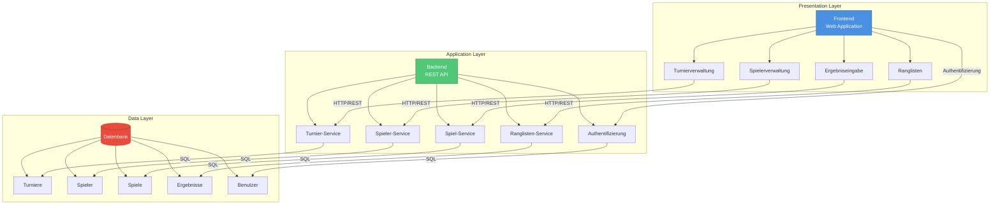

# Systemarchitektur: Jass Tournament Manager

## Übersicht

Die Jass Tournament Manager Applikation folgt einer klassischen **3-Tier-Architektur** mit klarer Trennung zwischen Präsentationsschicht, Geschäftslogik und Datenhaltung.

## Architekturdiagramm

## Komponentenbeschreibung

### Frontend (Presentation Layer)

**Technologie-Empfehlungen:**
- React / Vue.js / Angular für moderne SPA
- HTML5, CSS3, JavaScript/TypeScript
- Responsive Design Framework (Bootstrap, Material-UI, Tailwind)

**Hauptfunktionen:**
- **Turnierverwaltung**: Erstellen, Bearbeiten, Löschen von Turnieren
- **Spielerverwaltung**: Registrierung und Verwaltung von Teilnehmern
- **Ergeiseingabe**: Eingabe und Validierung von Spielergebnissen
- **Ranglisten**: Anzeige von aktuellen Ständen und Statistiken

### Backend (Application Layer)

**Technologie-Empfehlungen:**
- Node.js (Express) / Python (FastAPI/Django) / Java (Spring Boot)
- RESTful API Design
- JWT für Authentifizierung
- Input-Validierung und Error-Handling

**Services:**
- **Authentifizierung**: Login, Registrierung, Session-Management
- **Turnier-Service**: CRUD-Operationen für Turniere
- **Spieler-Service**: Verwaltung von Spielerdaten
- **Spiel-Service**: Spiellogik und Ergebnisvalidierung
- **Ranglisten-Service**: Berechnung und Bereitstellung von Rankings

### Datenbank (Data Layer)

**Technologie-Empfehlungen:**
- PostgreSQL / MySQL (relationale Datenbank)
- Alternative: MongoDB (NoSQL für flexiblere Datenstrukturen)

**Datenmodell:**
- **Benutzer**: Authentifizierungsdaten, Rollen
- **Spieler**: Profildaten, Statistiken
- **Turniere**: Turnierinformationen, Modus, Datum
- **Spiele**: Einzelne Spiele innerhalb eines Turniers
- **Ergebnisse**: Punkte, Gewinner, Zeitstempel

## Kommunikationsfluss

1. **Benutzer** interagiert mit dem **Frontend**
2. **Frontend** sendet HTTP-Requests an **Backend-API**
3. **Backend** validiert Anfragen und führt Business-Logik aus
4. **Backend** kommuniziert mit **Datenbank** via SQL/ORM
5. **Datenbank** liefert Daten zurück an **Backend**
6. **Backend** formatiert Response und sendet an **Frontend**
7. **Frontend** aktualisiert UI für **Benutzer**

## Sicherheitsaspekte

- HTTPS für alle Kommunikation
- JWT-basierte Authentifizierung
- Input-Validierung auf Frontend und Backend
- SQL-Injection-Schutz durch Prepared Statements
- CORS-Konfiguration
- Rate Limiting für API-Endpoints

## Skalierbarkeit

- **Frontend**: CDN für statische Assets
- **Backend**: Horizontal skalierbar durch Load Balancer
- **Datenbank**: Replikation und Sharding bei Bedarf
- Caching-Layer (Redis) für häufige Abfragen

## Deployment-Optionen

- **Frontend**: Vercel, Netlify, AWS S3 + CloudFront
- **Backend**: Heroku, AWS EC2/ECS, Google Cloud Run
- **Datenbank**: AWS RDS, Google Cloud SQL, managed Database Services
