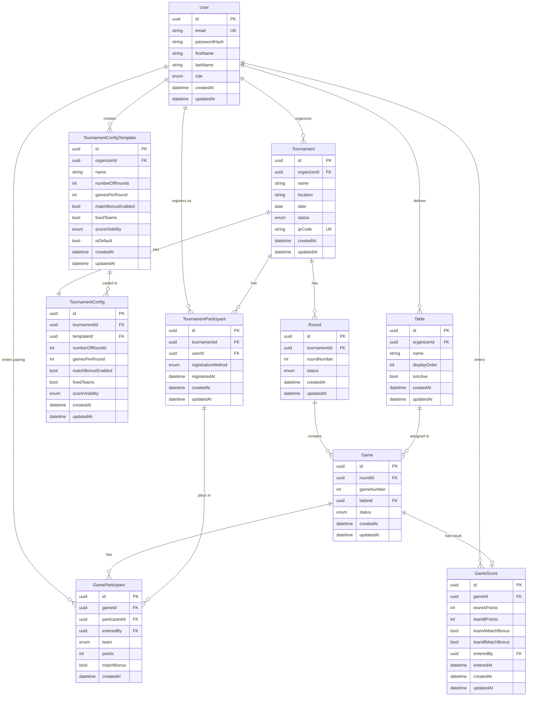

# Data Model: Jass Tournament Manager

## Entities and Relationships

### 1. User
**Description**: Authenticated users of the system (organizers and players)

| Field | Type | Description | Constraints |
|------|-----|--------------|-------------|
| id | UUID | Primary key | PK, NOT NULL |
| email | String | Email address | UNIQUE, NOT NULL |
| passwordHash | String | Hashed password | NOT NULL |
| firstName | String | First name | NOT NULL |
| lastName | String | Last name | NOT NULL |
| role | Enum | User role | NOT NULL |
| createdAt | DateTime | Creation timestamp | NOT NULL |
| updatedAt | DateTime | Update timestamp | NOT NULL |

**Roles**: `SYSADMIN`, `ORGANIZER`, `PLAYER`

**Relationships**:
- Has many `Tournament` as organizer (1:n)
- Has many `TournamentConfigTemplate` (1:n)
- Has many `TournamentParticipant` as player (1:n)

---

### 2. Tournament
**Description**: A Jass tournament created by an organizer

| Field | Type | Description | Constraints |
|------|-----|--------------|-------------|
| id | UUID | Primary key | PK, NOT NULL |
| organizerId | UUID | Organizer | FK, NOT NULL |
| name | String | Tournament name | NOT NULL |
| location | String | Venue/location | |
| date | Date | Tournament date | NOT NULL |
| status | Enum | Tournament status | NOT NULL, DEFAULT 'PLANNED' |
| qrCode | String | QR code for check-in | UNIQUE |
| createdAt | DateTime | Creation timestamp | NOT NULL |
| updatedAt | DateTime | Update timestamp | NOT NULL |

**Enums**:
- `status`: `OPEN`, `COMPLETED`, `CANCELLED`

**Relationships**:
- `organizerId` → `User.id` (n:1)
- Has one `TournamentConfig` (1:1)
- Has many `TournamentParticipant` (1:n)
- Has many `Round` (1:n)

---

### 3. TournamentConfigTemplate
**Description**: Reusable configuration templates for tournaments

| Field | Type | Description | Constraints |
|------|-----|--------------|-------------|
| id | UUID | Primary key | PK, NOT NULL |
| organizerId | UUID | Organizer | FK, NOT NULL |
| name | String | Template name | NOT NULL |
| numberOfRounds | Integer | Number of rounds | NOT NULL, DEFAULT 5 |
| gamesPerRound | Integer | Games per round | NOT NULL, DEFAULT 8 |
| matchBonusEnabled | Boolean | Match bonus enabled | NOT NULL, DEFAULT true |
| fixedTeams | Boolean | Fixed teams | NOT NULL, DEFAULT false |
| scoreVisibility | Enum | Score visibility | NOT NULL, DEFAULT 'ALWAYS_VISIBLE' |
| isDefault | Boolean | Default template | NOT NULL, DEFAULT false |
| createdAt | DateTime | Creation timestamp | NOT NULL |
| updatedAt | DateTime | Update timestamp | NOT NULL |

**Enums**:
- `scoreVisibility`: `ALWAYS_VISIBLE`, `HIDDEN_DURING_TOURNAMENT`, `ORGANIZER_ONLY`

**Relationships**:
- `organizerId` → `User.id` (n:1)
- Copied to `TournamentConfig` when creating a tournament

**Constraints**: UNIQUE(organizerId, name)

---

### 4. TournamentConfig
**Description**: Concrete configuration for a specific tournament (copy of a template)

| Field | Type | Description | Constraints |
|------|-----|--------------|-------------|
| id | UUID | Primary key | PK, NOT NULL |
| tournamentId | UUID | Tournament | FK, UNIQUE, NOT NULL |
| templateId | UUID | Original template | FK (optional) |
| numberOfRounds | Integer | Number of rounds | NOT NULL, DEFAULT 5 |
| gamesPerRound | Integer | Games per round | NOT NULL, DEFAULT 8 |
| matchBonusEnabled | Boolean | Match bonus enabled | NOT NULL, DEFAULT true |
| fixedTeams | Boolean | Fixed teams | NOT NULL, DEFAULT false |
| scoreVisibility | Enum | Score visibility | NOT NULL, DEFAULT 'ALWAYS_VISIBLE' |
| createdAt | DateTime | Creation timestamp | NOT NULL |
| updatedAt | DateTime | Update timestamp | NOT NULL |

**Enums**:
- `scoreVisibility`: `ALWAYS_VISIBLE`, `HIDDEN_DURING_TOURNAMENT`, `ORGANIZER_ONLY`

**Relationships**:
- `tournamentId` → `Tournament.id` (1:1)
- `templateId` → `TournamentConfigTemplate.id` (n:1, optional)

---

### 5. TournamentParticipant
**Description**: Players participating in a tournament

| Field | Type | Description | Constraints |
|------|-----|--------------|-------------|
| id | UUID | Primary key | PK, NOT NULL |
| tournamentId | UUID | Tournament | FK, NOT NULL |
| userId | UUID | User | FK, NOT NULL |
| registrationMethod | Enum | Registration method | NOT NULL |
| registeredAt | DateTime | Registration timestamp | NOT NULL |
| createdAt | DateTime | Creation timestamp | NOT NULL |
| updatedAt | DateTime | Update timestamp | NOT NULL |

**Enums**:
- `registrationMethod`: `MANUAL`, `QR_CODE`, `EXCEL_IMPORT`

**Relationships**:
- `tournamentId` → `Tournament.id` (n:1)
- `userId` → `User.id` (n:1)
- Has many `GameParticipant` (1:n)

**Constraints**: UNIQUE(tournamentId, userId)

**Note**: Email, firstName, lastName are stored in the `User` table

---

### 6. Round
**Description**: A round within a tournament

| Field | Type | Description | Constraints |
|------|-----|--------------|-------------|
| id | UUID | Primary key | PK, NOT NULL |
| tournamentId | UUID | Tournament | FK, NOT NULL |
| roundNumber | Integer | Round number (1-based) | NOT NULL |
| status | Enum | Round status | NOT NULL, DEFAULT 'PENDING' |
| createdAt | DateTime | Creation timestamp | NOT NULL |
| updatedAt | DateTime | Update timestamp | NOT NULL |

**Enums**:
- `status`: `OPEN`, `COMPLETED`

**Relationships**:
- `tournamentId` → `Tournament.id` (n:1)
- Has many `Game` (1:n)

**Constraints**: UNIQUE(tournamentId, roundNumber)

---

### 7. Table
**Description**: Predefined tables for an organizer (reusable)

| Field | Type | Description | Constraints |
|------|-----|--------------|-------------|
| id | UUID | Primary key | PK, NOT NULL |
| organizerId | UUID | Organizer | FK, NOT NULL |
| name | String | Table name/label | NOT NULL |
| displayOrder | Integer | Sort order | NOT NULL |
| isActive | Boolean | Table active | NOT NULL, DEFAULT true |
| createdAt | DateTime | Creation timestamp | NOT NULL |
| updatedAt | DateTime | Update timestamp | NOT NULL |

**Relationships**:
- `organizerId` → `User.id` (n:1)
- Has many `Game` (1:n)

**Constraints**: UNIQUE(organizerId, name)

---

### 8. Game
**Description**: A single game (2 vs 2) within a round

| Field | Type | Description | Constraints |
|------|-----|--------------|-------------|
| id | UUID | Primary key | PK, NOT NULL |
| roundId | UUID | Round | FK, NOT NULL |
| gameNumber | Integer | Game number within the round | NOT NULL |
| tableId | UUID | Table | FK (optional) |
| status | Enum | Game status | NOT NULL, DEFAULT 'OPEN' |
| createdAt | DateTime | Creation timestamp | NOT NULL |
| updatedAt | DateTime | Update timestamp | NOT NULL |

**Enums**:
- `status`: `OPEN`, `COMPLETED`

**Relationships**:
- `roundId` → `Round.id` (n:1)
- `tableId` → `Table.id` (n:1, optional)
- Has many `GameParticipant` (1:n, exactly 4)
- Has one `GameScore` (1:1, optional)

**Constraints**: UNIQUE(roundId, gameNumber)

---

### 9. GameParticipant
**Description**: Participants for a game (4 players: 2 vs 2)

| Field | Type | Description | Constraints |
|------|-----|--------------|-------------|
| id | UUID | Primary key | PK, NOT NULL |
| gameId | UUID | Game | FK, NOT NULL |
| participantId | UUID | Participant | FK, NOT NULL |
| team | Enum | Team (A or B) | NOT NULL |
| points | Integer | Points scored (denormalized) | |
| matchBonus | Boolean | Match bonus achieved | DEFAULT false |
| enteredBy | UUID | Entered by | FK (optional) |
| createdAt | DateTime | Creation timestamp | NOT NULL |

**Enums**:
- `team`: `TEAM_A`, `TEAM_B`

**Relationships**:
- `gameId` → `Game.id` (n:1)
- `participantId` → `TournamentParticipant.id` (n:1)
- `enteredBy` → `User.id` (n:1, optional)

**Constraints**: 
- UNIQUE(gameId, participantId)
- UNIQUE(gameId, team, participantId)

**Business rule**: Exactly 4 participants per game (2 per team)

---

### 10. GameScore
**Description**: Score/result of a game

| Field | Type | Description | Constraints |
|------|-----|--------------|-------------|
| id | UUID | Primary key | PK, NOT NULL |
| gameId | UUID | Game | FK, UNIQUE, NOT NULL |
| teamAPoints | Integer | Team A points | NOT NULL |
| teamBPoints | Integer | Team B points | NOT NULL |
| teamAMatchBonus | Boolean | Team A has match bonus | NOT NULL, DEFAULT false |
| teamBMatchBonus | Boolean | Team B has match bonus | NOT NULL, DEFAULT false |
| enteredBy | UUID | Entered by (User) | FK, NOT NULL |
| enteredAt | DateTime | Entry timestamp | NOT NULL |
| createdAt | DateTime | Creation timestamp | NOT NULL |
| updatedAt | DateTime | Update timestamp | NOT NULL |

**Relationships**:
- `gameId` → `Game.id` (1:1)
- `enteredBy` → `User.id` (n:1)

**Business rules**:
- `teamAPoints + teamBPoints = 157` (without match bonus)
- Match bonus: +100 points when a team scores 157 points
- Only one team can have the match bonus

---

## Entity Relationship Diagram (ERD)



## Geschäftsregeln

### Turnier-Regeln
1. **Organisator-Isolation**: Organisatoren sehen nur ihre eigenen Turniere
2. **SYSADMIN-Zugriff**: System-Administratoren können alle Turniere aller Organisatoren einsehen und verwalten
3. **Spieler-Sicht**: Spieler sehen nur Turniere, an denen sie teilnehmen
4. **QR-Code**: Jedes Turnier hat einen eindeutigen QR-Code für Teilnahme
5. **Ein-Tages-Turniere**: Alle Turniere dauern einen Tag
6. **Turnier-Status**: Einfache Status (OPEN, COMPLETED, CANCELLED) für einfache Bedienung

### Config-Template-Regeln
1. **Wiederverwendbarkeit**: Templates können für mehrere Turniere verwendet werden
2. **Kopie beim Erstellen**: Beim Turnier-Erstellen wird Config vom Template kopiert
3. **Unabhängigkeit**: Änderungen am Template betreffen nur neue Turniere
4. **Default-Template**: Organisator kann ein Standard-Template markieren
5. **Template-Referenz**: TournamentConfig behält Referenz zum ursprünglichen Template

### Runden-Regeln
1. **Anzahl Runden**: Konfigurierbar, Standard 5
2. **Spiele pro Runde**: Konfigurierbar, Standard 8
3. **Rundennummern**: Fortlaufend, 1-basiert

### Spiel-Regeln
1. **Teilnehmer**: Genau 4 Spieler pro Spiel (2 Teams à 2 Spieler)
2. **Punkte-Total**: 157 Punkte pro Spiel
3. **Match-Bonus**: +100 Punkte wenn ein Team alle 157 Punkte macht (konfigurierbar)
4. **Automatische Berechnung**: Wenn Team A Punkte einträgt, werden Team B Punkte automatisch berechnet (157 - Team A)
5. **Denormalisierung**: Punkte werden zusätzlich direkt beim Spieler (`GameParticipant`) gespeichert für schnelle Ranglisten
6. **Tischzuweisung**: Beim Auslosen werden Tische automatisch vergeben

### Paarungs-Regeln
1. **Normalfall**: Wechselnde Paarungen pro Runde (Spieler spielen für sich)
2. **Alternative**: Feste Teams über gesamtes Turnier (konfigurierbar)
3. **Paarungs-Eingabe**:
   - Organisator: Manuelle Eingabe oder automatische Zufallsauslosung
   - Spieler: Können ihren zugelosten Partner selbst eintragen
4. **Tracking**: `enteredBy` in `GameParticipant` zeigt, wer die Paarung erfasst hat

### Sichtbarkeits-Regeln
1. **ALWAYS_VISIBLE**: Spieler sehen immer alle Punkte
2. **HIDDEN_DURING_TOURNAMENT**: Punkte während Turnier ausgeblendet, danach sichtbar
3. **ORGANIZER_ONLY**: Nur Organisator sieht Punkte

### Teilnehmer-Regeln
1. **Nur registrierte Benutzer**: Alle Teilnehmer müssen User-Account haben
2. **Excel-Import**: Erstellt neue User-Accounts oder verknüpft bestehende
3. **Email als Identifier**: Matching via Email-Adresse

### Tisch-Regeln
1. **Organisator-Zuweisung**: Tische gehören dem Organisator, nicht einem spezifischen Turnier
2. **Wiederverwendung**: Tische können für alle Turniere des Organisators verwendet werden
3. **Flexible Benennung**: Tische können beliebig benannt werden
4. **Automatische Zuweisung**: Beim Auslosen werden Spiele auf verfügbare Tische verteilt
5. **Sortierung**: Tische haben displayOrder für konsistente Anzeige
5. **Deaktivierung**: Tische können deaktiviert werden (isActive = false)
6. **Löschung**: Tisch kann nur gelöscht werden, wenn keine Spiele zugewiesen

## Indizes (Performance-Optimierung)

```sql
-- Häufige Abfragen
CREATE INDEX idx_tournament_organizer ON Tournament(organizerId);
CREATE INDEX idx_tournament_status ON Tournament(status);
CREATE INDEX idx_tournament_date ON Tournament(date);

CREATE INDEX idx_config_template_organizer ON TournamentConfigTemplate(organizerId);
CREATE INDEX idx_config_template_default ON TournamentConfigTemplate(organizerId, isDefault);

CREATE INDEX idx_participant_tournament ON TournamentParticipant(tournamentId);
CREATE INDEX idx_participant_user ON TournamentParticipant(userId);

CREATE INDEX idx_round_tournament ON Round(tournamentId);
CREATE INDEX idx_round_status ON Round(status);

CREATE INDEX idx_table_organizer ON Table(organizerId);
CREATE INDEX idx_table_active ON Table(organizerId, isActive);

CREATE INDEX idx_game_round ON Game(roundId);
CREATE INDEX idx_game_status ON Game(status);

CREATE INDEX idx_game_participant_game ON GameParticipant(gameId);
CREATE INDEX idx_game_participant_participant ON GameParticipant(participantId);
CREATE INDEX idx_game_participant_points ON GameParticipant(participantId, points);

CREATE INDEX idx_game_score_game ON GameScore(gameId);
```

## Datenmigration & Import

### Excel-Import (für Organisatoren)
- **Primärer Zweck**: Import vergangener Turnierdaten
- Import von kompletten Turnieren inkl.:
  - Turnierinformationen (Name, Datum, Ort)
  - Teilnehmerdaten → User-Accounts erstellen/verknüpfen
  - Runden und Spiele
  - Spielergebnisse und Paarungen
- Matching bestehender Spieler via E-Mail-Adresse
- Automatische Erstellung aller relevanten Entitäten
- Validierung der importierten Daten

## Änderungen gegenüber vorheriger Version

### Entfernt
- ❌ `Tournament.description`
- ❌ `Tournament.startDate/endDate` → nur `date`
- ❌ `TournamentConfig.announcementsPerPlayer`
- ❌ `TournamentConfig.hideScoresDuringTournament`
- ❌ `TournamentConfig.allowPlayerScoreView`
- ❌ `TournamentParticipant.email/firstName/lastName`
- ❌ `Round.startTime/endTime`
- ❌ `Game.startTime/endTime`
- ❌ `GameParticipant.position`

### Hinzugefügt
- ✅ `TournamentConfigTemplate` (neue Tabelle)
- ✅ `TournamentConfig.templateId`
- ✅ `TournamentConfig.scoreVisibility` (ENUM)
- ✅ `TournamentConfigTemplate.isDefault`

### Geändert
- 🔄 `TournamentParticipant.userId` → NOT NULL (immer Account erforderlich)
- 🔄 `Tournament` → nur ein `date` statt `startDate/endDate`
- 🔄 Score Visibility → vereinfacht zu einem ENUM

## Nächste Schritte

1. ✅ Datenmodell überarbeitet
2. ⏭️ Prisma Schema aktualisieren
3. ⏭️ Migrations erstellen
4. ⏭️ Seed-Daten für Entwicklung
