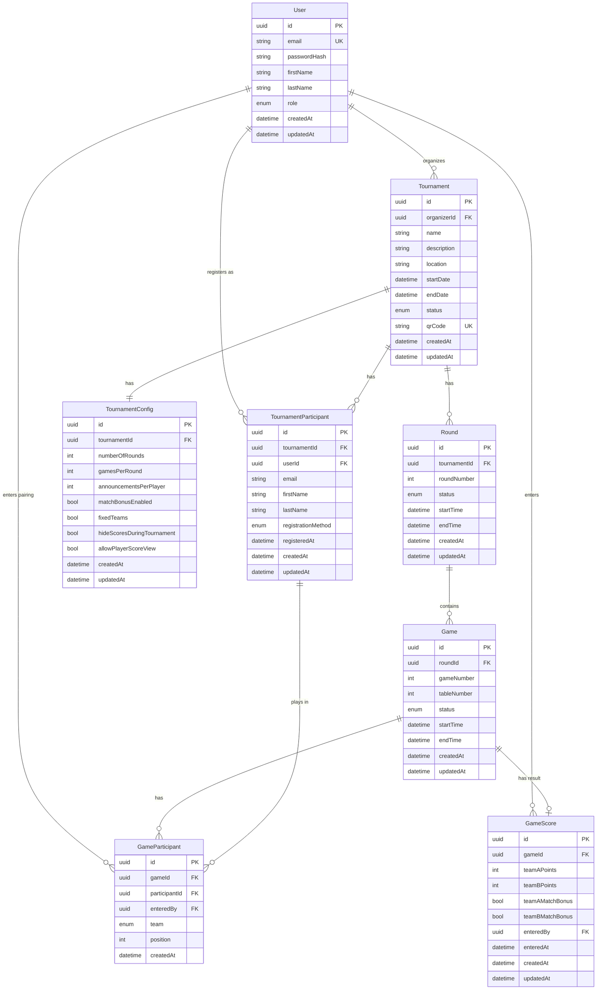

# Datenmodell: Jass Tournament Manager

## Entitäten und Beziehungen

### 1. User (Benutzer)
**Beschreibung**: Authentifizierte Benutzer des Systems (Organisatoren und Spieler)

| Feld | Typ | Beschreibung | Constraints |
|------|-----|--------------|-------------|
| id | UUID | Primärschlüssel | PK, NOT NULL |
| email | String | E-Mail-Adresse | UNIQUE, NOT NULL |
| passwordHash | String | Gehashtes Passwort | NOT NULL |
| firstName | String | Vorname | NOT NULL |
| lastName | String | Nachname | NOT NULL |
| role | Enum | Benutzerrolle | NOT NULL |
| createdAt | DateTime | Erstellungszeitpunkt | NOT NULL |
| updatedAt | DateTime | Aktualisierungszeitpunkt | NOT NULL |

**Rollen**: `SYSADMIN`, `ORGANIZER`, `PLAYER`

**Beziehungen**:
- Hat viele `Tournament` als Organisator (1:n)
- Hat viele `TournamentParticipant` als Spieler (1:n)

---

### 2. Tournament (Turnier)
**Beschreibung**: Jass-Turnier eines Organisators

| Feld | Typ | Beschreibung | Constraints |
|------|-----|--------------|-------------|
| id | UUID | Primärschlüssel | PK, NOT NULL |
| organizerId | UUID | Organisator | FK, NOT NULL |
| name | String | Turniername | NOT NULL |
| description | String | Beschreibung | |
| location | String | Austragungsort | |
| startDate | DateTime | Startdatum | NOT NULL |
| endDate | DateTime | Enddatum | |
| status | Enum | Turnierstatus | NOT NULL, DEFAULT 'PLANNED' |
| qrCode | String | QR-Code für Teilnahme | UNIQUE |
| createdAt | DateTime | Erstellungszeitpunkt | NOT NULL |
| updatedAt | DateTime | Aktualisierungszeitpunkt | NOT NULL |

**Enums**:
- `status`: `PLANNED`, `REGISTRATION_OPEN`, `IN_PROGRESS`, `COMPLETED`, `CANCELLED`

**Beziehungen**:
- `organizerId` → `User.id` (n:1)
- Hat ein `TournamentConfig` (1:1)
- Hat viele `TournamentParticipant` (1:n)
- Hat viele `Round` (1:n)

---

### 3. TournamentConfig (Turnier-Konfiguration)
**Beschreibung**: Konfigurationsparameter für ein Turnier

| Feld | Typ | Beschreibung | Constraints |
|------|-----|--------------|-------------|
| id | UUID | Primärschlüssel | PK, NOT NULL |
| tournamentId | UUID | Turnier | FK, UNIQUE, NOT NULL |
| numberOfRounds | Integer | Anzahl Runden | NOT NULL, DEFAULT 5 |
| gamesPerRound | Integer | Spiele pro Runde | NOT NULL, DEFAULT 8 |
| announcementsPerPlayer | Integer | Ansagen pro Spieler | NOT NULL, DEFAULT 2 |
| matchBonusEnabled | Boolean | Match-Bonus aktiviert | NOT NULL, DEFAULT true |
| fixedTeams | Boolean | Feste Teams (vs. wechselnde Paarungen) | NOT NULL, DEFAULT false |
| hideScoresDuringTournament | Boolean | Punkte während Turnier ausblenden | NOT NULL, DEFAULT false |
| allowPlayerScoreView | Boolean | Spieler dürfen Punkte sehen | NOT NULL, DEFAULT true |
| createdAt | DateTime | Erstellungszeitpunkt | NOT NULL |
| updatedAt | DateTime | Aktualisierungszeitpunkt | NOT NULL |

**Beziehungen**:
- `tournamentId` → `Tournament.id` (1:1)

---

### 4. TournamentParticipant (Turnier-Teilnehmer)
**Beschreibung**: Spieler, die an einem Turnier teilnehmen

| Feld | Typ | Beschreibung | Constraints |
|------|-----|--------------|-------------|
| id | UUID | Primärschlüssel | PK, NOT NULL |
| tournamentId | UUID | Turnier | FK, NOT NULL |
| userId | UUID | Benutzer (falls registriert) | FK (optional) |
| email | String | E-Mail (für Identifikation) | NOT NULL |
| firstName | String | Vorname | NOT NULL |
| lastName | String | Nachname | NOT NULL |
| registrationMethod | Enum | Registrierungsmethode | NOT NULL |
| registeredAt | DateTime | Anmeldezeitpunkt | NOT NULL |
| createdAt | DateTime | Erstellungszeitpunkt | NOT NULL |
| updatedAt | DateTime | Aktualisierungszeitpunkt | NOT NULL |

**Enums**:
- `registrationMethod`: `MANUAL`, `QR_CODE`, `EXCEL_IMPORT`

**Beziehungen**:
- `tournamentId` → `Tournament.id` (n:1)
- `userId` → `User.id` (n:1, optional)
- Hat viele `GameParticipant` (1:n)

**Constraints**: UNIQUE(tournamentId, email)

---

### 5. Round (Runde)
**Beschreibung**: Eine Runde innerhalb eines Turniers

| Feld | Typ | Beschreibung | Constraints |
|------|-----|--------------|-------------|
| id | UUID | Primärschlüssel | PK, NOT NULL |
| tournamentId | UUID | Turnier | FK, NOT NULL |
| roundNumber | Integer | Rundennummer (1-basiert) | NOT NULL |
| status | Enum | Rundenstatus | NOT NULL, DEFAULT 'PENDING' |
| startTime | DateTime | Startzeit | |
| endTime | DateTime | Endzeit | |
| createdAt | DateTime | Erstellungszeitpunkt | NOT NULL |
| updatedAt | DateTime | Aktualisierungszeitpunkt | NOT NULL |

**Enums**:
- `status`: `PENDING`, `IN_PROGRESS`, `COMPLETED`

**Beziehungen**:
- `tournamentId` → `Tournament.id` (n:1)
- Hat viele `Game` (1:n)

**Constraints**: UNIQUE(tournamentId, roundNumber)

---

### 6. Game (Spiel)
**Beschreibung**: Ein einzelnes Spiel (2vs2) innerhalb einer Runde

| Feld | Typ | Beschreibung | Constraints |
|------|-----|--------------|-------------|
| id | UUID | Primärschlüssel | PK, NOT NULL |
| roundId | UUID | Runde | FK, NOT NULL |
| gameNumber | Integer | Spielnummer in Runde | NOT NULL |
| tableNumber | Integer | Tischnummer | |
| status | Enum | Spielstatus | NOT NULL, DEFAULT 'PENDING' |
| startTime | DateTime | Startzeit | |
| endTime | DateTime | Endzeit | |
| createdAt | DateTime | Erstellungszeitpunkt | NOT NULL |
| updatedAt | DateTime | Aktualisierungszeitpunkt | NOT NULL |

**Enums**:
- `status`: `PENDING`, `IN_PROGRESS`, `COMPLETED`, `CANCELLED`

**Beziehungen**:
- `roundId` → `Round.id` (n:1)
- Hat viele `GameParticipant` (1:n, genau 4)
- Hat ein `GameScore` (1:1, optional)

**Constraints**: UNIQUE(roundId, gameNumber)

---

### 7. GameParticipant (Spiel-Teilnehmer)
**Beschreibung**: Paarungen für ein Spiel (4 Spieler: 2vs2)

| Feld | Typ | Beschreibung | Constraints |
|------|-----|--------------|-------------|
| id | UUID | Primärschlüssel | PK, NOT NULL |
| gameId | UUID | Spiel | FK, NOT NULL |
| participantId | UUID | Teilnehmer | FK, NOT NULL |
| team | Enum | Team (A oder B) | NOT NULL |
| position | Integer | Position im Team (1 oder 2) | NOT NULL |
| enteredBy | UUID | Eingetragen von (User/Organisator) | FK (optional) |
| createdAt | DateTime | Erstellungszeitpunkt | NOT NULL |

**Enums**:
- `team`: `TEAM_A`, `TEAM_B`

**Beziehungen**:
- `gameId` → `Game.id` (n:1)
- `participantId` → `TournamentParticipant.id` (n:1)
- `enteredBy` → `User.id` (n:1, optional)

**Constraints**: 
- UNIQUE(gameId, participantId)
- UNIQUE(gameId, team, position)

**Geschäftsregel**: Genau 4 Teilnehmer pro Spiel (2 pro Team)

---

### 8. GameScore (Spielergebnis)
**Beschreibung**: Punktestand eines Spiels

| Feld | Typ | Beschreibung | Constraints |
|------|-----|--------------|-------------|
| id | UUID | Primärschlüssel | PK, NOT NULL |
| gameId | UUID | Spiel | FK, UNIQUE, NOT NULL |
| teamAPoints | Integer | Punkte Team A | NOT NULL |
| teamBPoints | Integer | Punkte Team B | NOT NULL |
| teamAMatchBonus | Boolean | Team A hat Match-Bonus | NOT NULL, DEFAULT false |
| teamBMatchBonus | Boolean | Team B hat Match-Bonus | NOT NULL, DEFAULT false |
| enteredBy | UUID | Erfasst von (User) | FK, NOT NULL |
| enteredAt | DateTime | Erfassungszeitpunkt | NOT NULL |
| createdAt | DateTime | Erstellungszeitpunkt | NOT NULL |
| updatedAt | DateTime | Aktualisierungszeitpunkt | NOT NULL |

**Beziehungen**:
- `gameId` → `Game.id` (1:1)
- `enteredBy` → `User.id` (n:1)

**Geschäftsregeln**:
- `teamAPoints + teamBPoints = 157` (ohne Match-Bonus)
- Match-Bonus: +100 Punkte wenn ein Team 157 Punkte hat
- Nur ein Team kann Match-Bonus haben

---

## Entity Relationship Diagram (ERD)



## Geschäftsregeln

### Turnier-Regeln
1. **Organisator-Isolation**: Organisatoren sehen nur ihre eigenen Turniere
2. **SYSADMIN-Zugriff**: System-Administratoren können alle Turniere aller Organisatoren einsehen und verwalten
3. **Spieler-Sicht**: Spieler sehen nur Turniere, an denen sie teilnehmen
4. **QR-Code**: Jedes Turnier hat einen eindeutigen QR-Code für Teilnahme
5. **Teilnehmer-Identifikation**: E-Mail-Adresse ist eindeutig pro Turnier

### Runden-Regeln
1. **Anzahl Runden**: Konfigurierbar, Standard 5
2. **Spiele pro Runde**: Konfigurierbar, Standard 8
3. **Rundennummern**: Fortlaufend, 1-basiert

### Spiel-Regeln
1. **Teilnehmer**: Genau 4 Spieler pro Spiel (2 Teams à 2 Spieler)
2. **Punkte-Total**: 157 Punkte pro Spiel
3. **Match-Bonus**: +100 Punkte wenn ein Team alle 157 Punkte macht (konfigurierbar)
4. **Automatische Berechnung**: Wenn Team A Punkte einträgt, werden Team B Punkte automatisch berechnet (157 - Team A)

### Paarungs-Regeln
1. **Normalfall**: Wechselnde Paarungen pro Runde (Spieler spielen für sich)
2. **Alternative**: Feste Teams über gesamtes Turnier (konfigurierbar)
3. **Paarungs-Eingabe**:
   - Organisator: Manuelle Eingabe oder automatische Zufallsauslosung
   - Spieler: Können ihren zugelosten Partner selbst eintragen
4. **Tracking**: `enteredBy` in `GameParticipant` zeigt, wer die Paarung erfasst hat

### Sichtbarkeits-Regeln
1. **Während Turnier**: Punkte können ausgeblendet werden (konfigurierbar)
2. **Nach Turnier**: Spieler-Zugriff auf Punkte konfigurierbar
3. **Ranglisten**: Spieler können Ranglisten von Turnieren eines Organisators sehen

## Indizes (Performance-Optimierung)

```sql
-- Häufige Abfragen
CREATE INDEX idx_tournament_organizer ON Tournament(organizerId);
CREATE INDEX idx_tournament_status ON Tournament(status);
CREATE INDEX idx_tournament_start_date ON Tournament(startDate);

CREATE INDEX idx_participant_tournament ON TournamentParticipant(tournamentId);
CREATE INDEX idx_participant_user ON TournamentParticipant(userId);
CREATE INDEX idx_participant_email ON TournamentParticipant(email);

CREATE INDEX idx_round_tournament ON Round(tournamentId);
CREATE INDEX idx_round_status ON Round(status);

CREATE INDEX idx_game_round ON Game(roundId);
CREATE INDEX idx_game_status ON Game(status);

CREATE INDEX idx_game_participant_game ON GameParticipant(gameId);
CREATE INDEX idx_game_participant_participant ON GameParticipant(participantId);

CREATE INDEX idx_game_score_game ON GameScore(gameId);
```

## Datenmigration & Import

### Excel-Import (für Organisatoren)
- **Primärer Zweck**: Import vergangener Turnierdaten
- Import von kompletten Turnieren inkl.:
  - Turnierinformationen (Name, Datum, Ort, Konfiguration)
  - Teilnehmerdaten (Vorname, Nachname, E-Mail)
  - Runden und Spiele
  - Spielergebnisse und Paarungen
- Matching bestehender Spieler via E-Mail-Adresse
- Automatische Erstellung aller relevanten Entitäten
- Validierung der importierten Daten

## Nächste Schritte

1. ✅ Datenmodell dokumentiert
2. ⏭️ Prisma Schema implementieren
3. ⏭️ Migrations erstellen
4. ⏭️ Seed-Daten für Entwicklung
