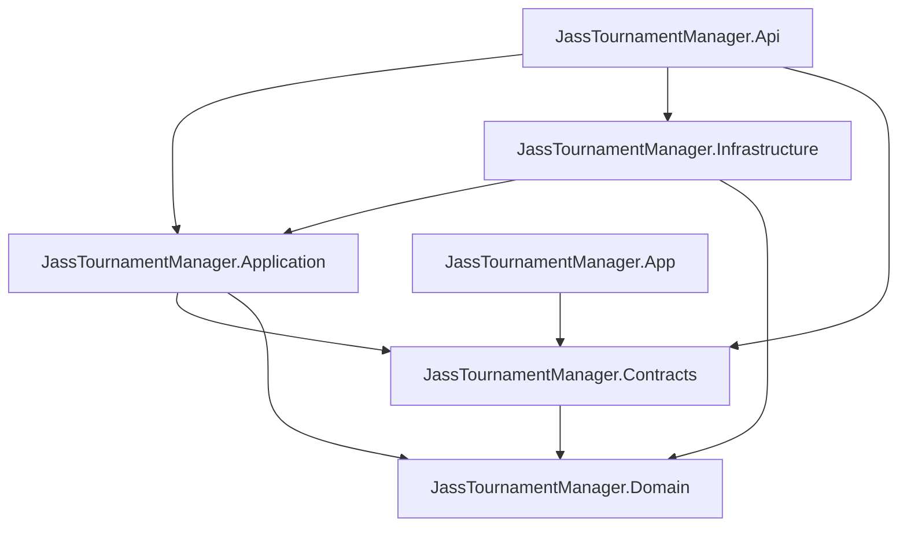

# System Architecture: Jass Tournament Manager

## Overview

The Jass Tournament Manager application follows a classic 3-tier architecture with a clear separation between the presentation layer, application/business logic, and data storage.

# Technology Stack

## Frontend

- .NET MAUI (CommunityToolkit.Maui & Uranium UI)
- MVVM Pattern
- REST API communication
- Cross-platform support

## Backend

- .NET 10 / ASP.NET Core Web API
- Swagger / OpenAPI
- Entity Framework Core
- FluentValidation (planned)

## Database

- PostgreSQL 16
- EF Core migrations with Npgsql provider

## DevOps

- Docker
- Docker Compose
- GitHub
- GitHub Actions
- Reverse proxy (Caddy or Nginx or Traefik)
- TLS via Let's Encrypt

---

## Component Description

## Project Dependencies

The solution uses a layered architecture with the Domain project as the innermost layer. Dependencies must point inward or toward explicitly shared contracts.

Allowed production project references:



```text
JassTournamentManager.Domain
  -> no project references

JassTournamentManager.Contracts
  -> JassTournamentManager.Domain

JassTournamentManager.Application
  -> JassTournamentManager.Domain
  -> JassTournamentManager.Contracts

JassTournamentManager.Infrastructure
  -> JassTournamentManager.Domain
  -> JassTournamentManager.Application

JassTournamentManager.Api
  -> JassTournamentManager.Application
  -> JassTournamentManager.Infrastructure
  -> JassTournamentManager.Contracts

JassTournamentManager.App
  -> JassTournamentManager.Contracts
```

Dependency rules:
- `Domain` contains entities, value objects, enums, domain services, and invariants. It must not reference API, Application, Infrastructure, Contracts, EF Core, ASP.NET Core, or UI frameworks.
- `Contracts` contains transport DTOs shared across API and clients. It may reference `Domain` for stable domain enums, but must not expose domain entities as DTOs.
- `Application` contains use cases, application services, repository interfaces, unit-of-work abstractions, and application-level result/error types. It must not reference EF Core, PostgreSQL, ASP.NET Core, MAUI, or other infrastructure concerns.
- `Infrastructure` implements technical details such as EF Core persistence, repository implementations, migrations, and external service adapters. It may implement interfaces defined by `Application`.
- `Api` is the HTTP composition root for the backend. It wires dependency injection, ASP.NET Core middleware, controllers, configuration, and infrastructure implementations.
- `App` is the MAUI client. It communicates with the backend through HTTP and shared contracts; it must not reference `Application`, `Infrastructure`, or backend persistence types.

Test projects may reference the production projects they verify. Infrastructure tests may use Docker/PostgreSQL and EF Core to verify persistence mappings and database constraints.

### Frontend (Presentation Layer)

Main responsibilities:
- Tournament management: create, edit, configure tournaments
- Player management: registration, Excel import, participant management
- Pairing management: manual entry, automated pairing, player self-signup
- Score entry: point entry with automatic calculations (157-point system)
- Leaderboards: live standings, statistics, reports

User roles:
- SYSADMIN: full access for support
- ORGANIZER: manage own tournaments
- PLAYER: enter scores, select partners, view leaderboards

Features:
- Cross-platform UI for desktop and mobile via .NET MAUI
- QR-code generation for tournament check-in
- Configurable score visibility
- Excel import for historical data (see backend service)

---

### Backend (Application Layer)

Services and responsibilities:

1) Authentication Service
- User registration & login
- JWT issuance and validation
- Refresh token issuance, rotation, and revocation
- Role-based access control (RBAC)
- Password hashing via ASP.NET Core Identity (secure PBKDF2-based hasher)

2) Tournament Service
- CRUD operations for tournaments
- Tournament configuration (rounds, games, match-bonus, etc.)
- Propagate tournament configuration changes that affect existing domain objects (for example match-bonus changes on existing games)
- QR-code generation for check-in
- Tournament status management

3) Participant Service
- Participant management and registration
- Excel import handling (server-side parsing)
- Email-based matching and lookups
- Player statistics

4) Game Service
- Round and game management
- Pairing logic (manual and automatic)
- Player self-signup and partner selection
- Game status tracking

5) Score Service
- Score entry and validation
- Automatic calculations (157-point system)
- Match-bonus logic (+100 when enabled for the tournament and applicable)

6) Leaderboard Service
- Compute standings and leaderboards
- Aggregated statistics per organizer and tournament
- Future version: Respect tournament-level exclusions when computing organizer-wide all-time leaderboards, while leaving tournament-specific leaderboards unchanged

7) Excel Import Service
- Parse Excel files using .NET libraries (e.g. ClosedXML or EPPlus)
- Validate and transform incoming data
- Bulk insert with transactions

API design:
- RESTful endpoints, JSON request/response
- Standardized error model
- Input validation using DataAnnotations and/or FluentValidation
- OpenAPI/Swagger documentation

---

### Data Layer

Architecture decision:
- Domain constructors, value objects, and domain methods are the authoritative place for business defaults and invariants.
- The database schema focuses on relational integrity and physical storage boundaries: primary keys, foreign keys, nullability, max lengths, indexes, unique constraints, and explicit delete behavior.
- Database defaults and check constraints are intentionally not duplicated for rules that are already enforced by the domain model. Direct database writes are treated as exceptional maintenance work and must respect domain invariants manually.

Business rules:
- Organizer isolation (each organizer sees only their own tournaments, SYSADMIN exception)
- Automatic score calculation where applicable

Performance considerations:
- Strategic indexes on frequently queried columns (organizerId, tournamentId, userId, status)
- Query optimization for organizer-specific views and leaderboard calculations

---

## Security Considerations

Authentication & authorization:
- JWT-based auth (tokens sent via Authorization header or HTTP-only cookies)
- Refresh tokens are persisted only as hashes and are rotated when a session is refreshed
- Logout revokes the submitted active refresh token
- Role-based access control (SYSADMIN, ORGANIZER, PLAYER)
- Password hashing via ASP.NET Core Identity (recommended) or a vetted hashing algorithm

API security:
- HTTPS/TLS enforced
- Proper CORS configuration
- Input validation on both client and server

Data protection / privacy:
- Organizer isolation and least-privilege access
- SYSADMIN access limited to support needs
- Players see only tournaments they participate in

---

Backup strategy:
- Regular PostgreSQL backups (pg_dump or base backups)
- Daily retention/rotation (e.g. 7 days) and offsite copies
- Persistent volumes for database containers

---

## Scalability

Horizontal scaling:
- Backend: multiple API instances behind a load balancer
- Database: PostgreSQL replication and read replicas for heavy read workloads
- Caching: Redis for sessions, rate-limiting and hot data

Vertical scaling:
- Increase CPU/RAM / use faster storage (SSD) for DB when needed

Performance optimizations:
- Database indexes (see database-schema.md)
- API response caching for non-critical endpoints
- Efficient leaderboard aggregation (pre-aggregation where necessary)
- Lazy loading and prudent resource usage in MAUI client

---
