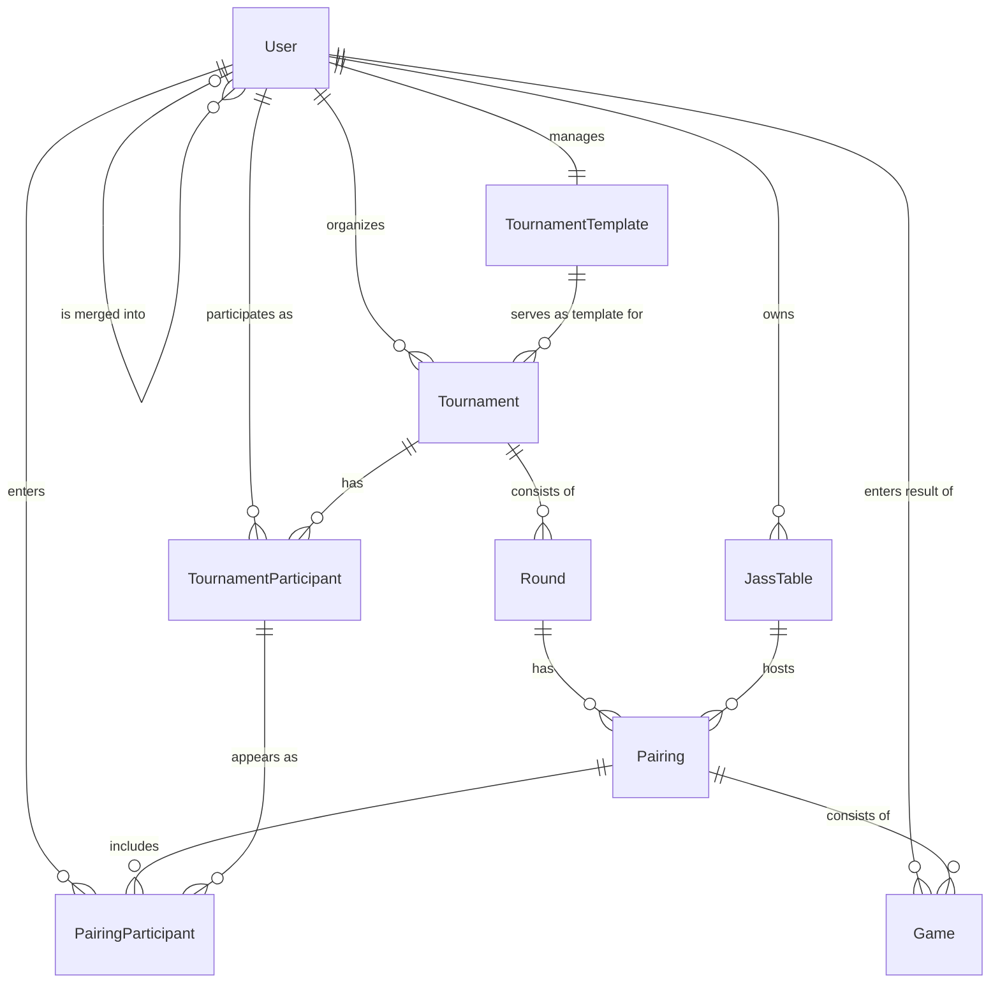

# Data Model: Jass Tournament Manager

## Entity Relationship Diagram



## Entities

Note: Defaults listed in this document describe domain-level defaults unless explicitly stated otherwise. Entity creation is expected to go through the domain model; the database schema enforces relational integrity and uniqueness, but intentionally does not duplicate domain invariants with database defaults or check constraints.

### 1. User
**Description**: Authenticated users of the system (organizers and players)

| Field | Type | Description | Constraints |
|------|-----|--------------|-------------|
| id | UUID | Primary key | PK, NOT NULL |
| email | varchar(320) | Email address | UNIQUE, |
| passwordHash | text | Hashed password | |
| firstName | varchar(50) | First name | NOT NULL |
| lastName | varchar(50) | Last name | NOT NULL |
| isActive | boolean | Is user active? | NOT NULL, DEFAULT true |
| isSysAdmin | Boolean | Whether user is sysAdmin | NOT NULL, DEFAULT false |
| sourceType | Enum | How was the user created? | NOT NULL|
| mergeTargetUserId | UUID | merge target user id | FK |
| mergedAt | DateTime | merge time | |
| mergedBy | UUID | user id of merging user | FK |
| createdAt | DateTime | Creation timestamp | NOT NULL |
| updatedAt | DateTime | Update timestamp | NOT NULL |

**Enums**:
- `sourceTypes`: `MANUAL`, `EXCEL_IMPORT`, `SELF_REGISTERED`

---

### 2. Tournament
**Description**: A Jass tournament created by an organizer

| Field | Type | Description | Constraints |
|------|-----|--------------|-------------|
| id | UUID | Primary key | PK, NOT NULL |
| organizerId | UUID | User id of organizer | FK, NOT NULL |
| name | varchar(200) | Tournament name | NOT NULL |
| location | varchar(200) | Venue/location | |
| date | Date | Tournament date | NOT NULL |
| status | Enum | Tournament status | NOT NULL, DEFAULT 'ACTIVE' |
| tournamentCode | varchar(20) | Code which is used to join tournament | UNIQUE |
| numberOfRounds | Integer | Number of rounds | NOT NULL, DEFAULT 5 |
| gamesPerRound | Integer | Games per round | NOT NULL, DEFAULT 8 |
| matchBonusEnabled | Boolean | Match bonus enabled | NOT NULL, DEFAULT true |
| isFixedTeams | Boolean | Fixed teams | NOT NULL, DEFAULT false |
| scoreVisibility | Enum | Score visibility | NOT NULL, DEFAULT 'HIDDEN_DURING_ACTIVE_TOURNAMENT' |
| createdAt | DateTime | Creation timestamp | NOT NULL |
| updatedAt | DateTime | Update timestamp | NOT NULL |

**Enums**:
- `status`: `ACTIVE`, `COMPLETED`, `CANCELLED`
- `scoreVisibility`: `ALWAYS_VISIBLE_FOR_EVERYONE`, `HIDDEN_DURING_ACTIVE_TOURNAMENT`, `ORGANIZER_ONLY`

---

### 3. TournamentTemplate
**Description**: Reusable configuration templates for tournaments

| Field | Type | Description | Constraints |
|------|-----|--------------|-------------|
| id | UUID | Primary key | PK, NOT NULL |
| organizerId | UUID | User id of organizer | FK, NOT NULL |
| numberOfRounds | Integer | Number of rounds | NOT NULL, DEFAULT 5 |
| gamesPerRound | Integer | Games per round | NOT NULL, DEFAULT 8 |
| matchBonusEnabled | Boolean | Match bonus enabled | NOT NULL, DEFAULT true |
| isFixedTeams | Boolean | Fixed teams | NOT NULL, DEFAULT false |
| scoreVisibility | Enum | Score visibility | NOT NULL, DEFAULT 'HIDDEN_DURING_ACTIVE_TOURNAMENT' |
| location | varchar(200) | Venue/location | |
| createdAt | DateTime | Creation timestamp | NOT NULL |
| updatedAt | DateTime | Update timestamp | NOT NULL |

**Enums**:
- `scoreVisibility`: `ALWAYS_VISIBLE_FOR_EVERYONE`, `HIDDEN_DURING_ACTIVE_TOURNAMENT`, `ORGANIZER_ONLY`

**Note**: Applied to newly created tournaments (but changes here have no effect on existing tournaments)

---

### 4. TournamentParticipant
**Description**: Players participating in a tournament

| Field | Type | Description | Constraints |
|------|-----|--------------|-------------|
| id | UUID | Primary key | PK, NOT NULL |
| tournamentId | UUID | Tournament | FK, NOT NULL |
| userId | UUID | User | FK, NOT NULL |
| role | Enum | Role | NOT NULL |
| isPlaying | Boolean | Indicates whether the participant plays in the tournament | NOT NULL, DEFAULT true|
| registrationMethod | Enum | Registration method | NOT NULL |
| createdAt | DateTime | Creation timestamp | NOT NULL |
| updatedAt | DateTime | Update timestamp | NOT NULL |

**Enums**:
- `registrationMethod`: `BY_ORGANIZER`, `VIA_TOURNAMENT_CODE`, `EXCEL_IMPORT`
- `role`: `ORGANIZER`, `PLAYER`

**Constraints**: UNIQUE(tournamentId, userId)

**Note**: Email, firstName, lastName are stored in the `User` table

---

### 5. Round
**Description**: A round within a tournament

| Field | Type | Description | Constraints |
|------|-----|--------------|-------------|
| id | UUID | Primary key | PK, NOT NULL |
| tournamentId | UUID | Tournament | FK, NOT NULL |
| roundNumber | Integer | Round number (1-based) | NOT NULL |
| status | Enum | Round status | NOT NULL, DEFAULT 'PENDING' |
| createdAt | DateTime | Creation timestamp | NOT NULL |
| updatedAt | DateTime | Update timestamp | NOT NULL |

**Enums**:
- `status`: `PENDING`, `ACTIVE`, `COMPLETED`

**Constraints**: UNIQUE(tournamentId, roundNumber)

---

### 6. JassTable
**Description**: Predefined jass tables for an organizer (reusable)

| Field | Type | Description | Constraints |
|------|-----|--------------|-------------|
| id | UUID | Primary key | PK, NOT NULL |
| organizerId | UUID | Organizer | FK, NOT NULL |
| name | varchar(100) | Jass table name/label | NOT NULL |
| displayOrder | Integer | Sort order | NOT NULL |
| isActive | Boolean | Table active | NOT NULL, DEFAULT true |
| createdAt | DateTime | Creation timestamp | NOT NULL |
| updatedAt | DateTime | Update timestamp | NOT NULL |

---

### 7. Pairing
**Description**: A single pairing consisting of four players within a round which plays a certain amount of games at a table.

| Field | Type | Description | Constraints |
|------|-----|--------------|-------------|
| id | UUID | Primary key | PK, NOT NULL |
| roundId | UUID | Round | FK, NOT NULL |
| jassTableId | UUID | JassTable | FK, NOT NULL|
| gamesPerRound | Integer | Number of games for this pairing | NOT NULL |
| status | Enum | Pairing status | NOT NULL, DEFAULT 'PENDING' |
| createdAt | DateTime | Creation timestamp | NOT NULL |
| updatedAt | DateTime | Update timestamp | NOT NULL |

**Enums**:
- `status`: `PENDING`, `COMPLETED`

**Constraints**: UNIQUE(roundId, jassTableId)

**Business rules**:
- Exactly 4 participants per pairing (2 per team)
- Exactly `gamesPerRound` games per pairing
- Pairing can only be completed when all games are completed

---

### 8. PairingParticipant
**Description**: Participants for a pairing (4 players: 2 vs 2)

| Field | Type | Description | Constraints |
|------|-----|--------------|-------------|
| id | UUID | Primary key | PK, NOT NULL |
| pairingId | UUID | Game | FK, NOT NULL |
| tournamentParticipantId | UUID | TournamentParticipant | FK, NOT NULL |
| team | Enum | Team (A or B) | NOT NULL |
| enteredBy | UUID | Entered by (User) | FK (optional) |
| createdAt | DateTime | Creation timestamp | NOT NULL |
| updatedAt | DateTime | Update timestamp | NOT NULL |

**Enums**:
- `team`: `TEAM_A`, `TEAM_B`

**Constraints**: 
- UNIQUE(pairingId, tournamentParticipantId)

---

### 9. Game

**Description**: A single game (2 vs 2) within a round

| Field | Type | Description | Constraints |
|------|-----|--------------|-------------|
| id | UUID | Primary key | PK, NOT NULL |
| pairingId | UUID | Pairing | FK, NOT NULL |
| gameNumber | Integer (1-based) | Game number within the round | NOT NULL |
| status | Enum | Game status | NOT NULL, DEFAULT 'PENDING' |
| matchBonusEnabled | Boolean | Whether match bonus is currently enabled for this game | NOT NULL |
| teamAPoints | Integer | Team A points | |
| teamBPoints | Integer | Team B points | |
| teamAMatchBonusReceived | Boolean | Team A has match bonus | DEFAULT false |
| teamBMatchBonusReceived | Boolean | Team B has match bonus | DEFAULT false |
| enteredBy | UUID | Entered by (User) | FK |
| enteredAt | DateTime | Entry timestamp | |
| createdAt | DateTime | Creation timestamp | NOT NULL |
| updatedAt | DateTime | Update timestamp | NOT NULL |

**Enums**:
- `status`: `PENDING`, `COMPLETED`

**Constraints**: UNIQUE(pairingId, gameNumber)

**Business rules**:
- `teamAPoints + teamBPoints = 157` (without match bonus)
- Match bonus: +100 points when a team takes all tricks and `matchBonusEnabled = true`
- Only one team can have the match bonus
- Changing the tournament match-bonus configuration updates existing games

---

## Business Rules

### Tournament Rules
1. **Tournament Visibility**: Users can see tournaments if they are either the organizer of the tournament or registered as a participant in that tournament.
2. **SYSADMIN Access**: System administrators can view and manage all tournaments of all organizers
3. **Tournament Code / QR Code**: Each tournament has a unique link/code which participants can use to join the tournament
4. **Single-Day Tournaments**: All tournaments last one day

### Config Template Rules
1. **Reusability**: Templates can be used for multiple tournaments
2. **Copy on Creation**: Tournament configuration is copied from the template when creating a tournament
3. **Independence**: Changes to a template only affect newly created tournaments
4. **Default template per organizer (V1)**: In the first version, each organizer has exactly one default configuration template.
Future versions may support multiple named templates per organizer.

### Round Rules
1. **Number of Rounds**: Configurable, default is 5
2. **Games per Round**: Configurable, default is 8
3. **Round Numbers**: Sequential, 1-based

### Game Rules
1. **Participants**: Exactly 4 players per game (2 teams of 2 players)
2. **Total Points**: 157 points per game
3. **Match Bonus**: +100 points if one team scores all 157 points and match bonus is enabled for the tournament
4. **Automatic Calculation**: When Team A enters points, Team B points are calculated automatically (`157 - Team A`)

### Pairing Rules
1. **Default Case**: Pairings change every round (players compete individually)
2. **Alternative**: Fixed teams throughout the entire tournament (configurable)
3. **Pairing Entry**:
   - Organizer: Manual entry (or automatic random draw)
   - Players: Can enter their assigned partner themselves
4. **Tracking**: `enteredBy` in `PairingParticipant` indicates who entered the pairing
5. **Completion**: A pairing can only be completed when it has exactly 4 participants, exactly 2 participants per team, exactly the configured number of games, and all games are completed.

### Visibility Rules
The configured score visibility mode determines who can see scores:

1. `ALWAYS_VISIBLE_FOR_EVERYONE`: Players can always see scores.
2. `HIDDEN_DURING_ACTIVE_TOURNAMENT`: Scores are hidden from players while the tournament is active and visible afterwards.
3. `ORGANIZER_ONLY`: Only the organizer can see scores.

### Participant Rules
1. **Registered Users Only**: All participants must have a user account
2. **Excel Import**: Creates new user accounts or links existing ones
3. **Email as Identifier**: Matching is performed via email address

### JassTable Rules
1. **Organizer Ownership**: JassTables belong to the organizer, not to a specific tournament
2. **Reusability**: JassTables can be reused for all tournaments of the organizer
3. **Flexible Naming**: JassTables can be named freely
4. **Sorting**: JassTables have a `displayOrder` for consistent display
5. **Deactivation**: JassTables can be deactivated (`isActive = false`)
6. **Deletion**: A table can only be deleted if no games/pairings are assigned to it

### Player Merge Rules
1. Organizers can merge imported player accounts with manually created or self-registered user accounts.
2. The target user remains active; the source user is marked as merged.
3. Merged users must not be usable for authentication or new tournament registrations.
4. Existing tournament participations remain assigned to the merged user account.

## Indices

### Performance optimization

```sql
-- User
CREATE INDEX idx_user_merge_target_user_id ON User(mergeTargetUserId);

-- Tournament
CREATE INDEX idx_tournament_organizer ON Tournament(organizerId);
CREATE INDEX idx_tournament_status ON Tournament(status);

-- TournamentTemplate
CREATE INDEX idx_tournament_template_organizer ON TournamentTemplate(organizerId);

-- TournamentParticipant
CREATE INDEX idx_participant_tournament ON TournamentParticipant(tournamentId);
CREATE INDEX idx_participant_user ON TournamentParticipant(userId);

-- Round
CREATE INDEX idx_round_tournament ON Round(tournamentId);

-- JassTable
CREATE INDEX idx_table_organizer ON JassTable(organizerId);
CREATE INDEX idx_table_active ON JassTable(organizerId, isActive);

-- Pairing
CREATE INDEX idx_pairing_round ON Pairing(roundId);

-- PairingParticipant
CREATE INDEX idx_pairing_participant_pairing ON PairingParticipant(pairingId);
CREATE INDEX idx_pairing_participant_participant ON PairingParticipant(participantId);

-- Game
CREATE INDEX idx_game_pairing ON Game(pairingId);

```

### Unique indices

```sql
-- User
CREATE UNIQUE INDEX ux_users_email
    ON users(email)
    WHERE email IS NOT NULL;

-- Tournament
CREATE UNIQUE INDEX ux_tournaments_tournament_code
    ON tournaments(tournament_code);

-- TournamentParticipant
CREATE UNIQUE INDEX ux_tournament_participants_user_tournament
    ON tournament_participants(user_id, tournament_id);

-- Round
CREATE UNIQUE INDEX ux_rounds_tournament_round_number
    ON rounds(tournament_id, round_number);

-- Pairing
CREATE UNIQUE INDEX ux_pairings_round_jass_table
    ON pairings(round_id, jass_table_id);

-- PairingParticipant
CREATE UNIQUE INDEX ux_pairing_participants_pairing_tournament_participant
    ON pairing_participants(pairing_id, tournament_participant_id);

-- Game
CREATE UNIQUE INDEX ux_games_pairing_game_number
    ON games(pairing_id, game_number);
```

## Data Migration & Import

### Excel Import (for Organizers)
- **Primary purpose**: Import historical tournament data
- Import of complete tournaments including:
  - Tournament information (name, date, location)
  - Participant data → create or link user accounts
  - Rounds and games
  - Game results and pairings
- Matching existing players via email address
- Automatic creation of all relevant entities
- Validation of imported data

